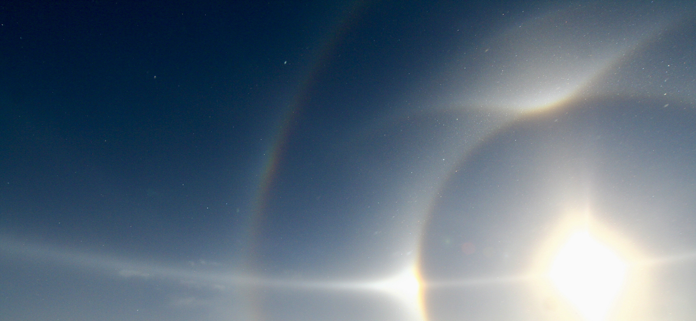

This (in-progress) collection contains MATLAB live scripts illustrating 
various topics in atmospheric science related to photography and 
observations of weather and atmospheric optical phenomena. These could be 
used by hobbiests, in classrooms, or for self-study. 

## Table of Contents

#### Noctilucent Clouds: How to Verify a Sighting

[nlc_verify.html](https://htmlpreview.github.io/?https://github.com/chrisjcox/atmos-optics-demos/blob/main/demos/ncl_verify.html) 
